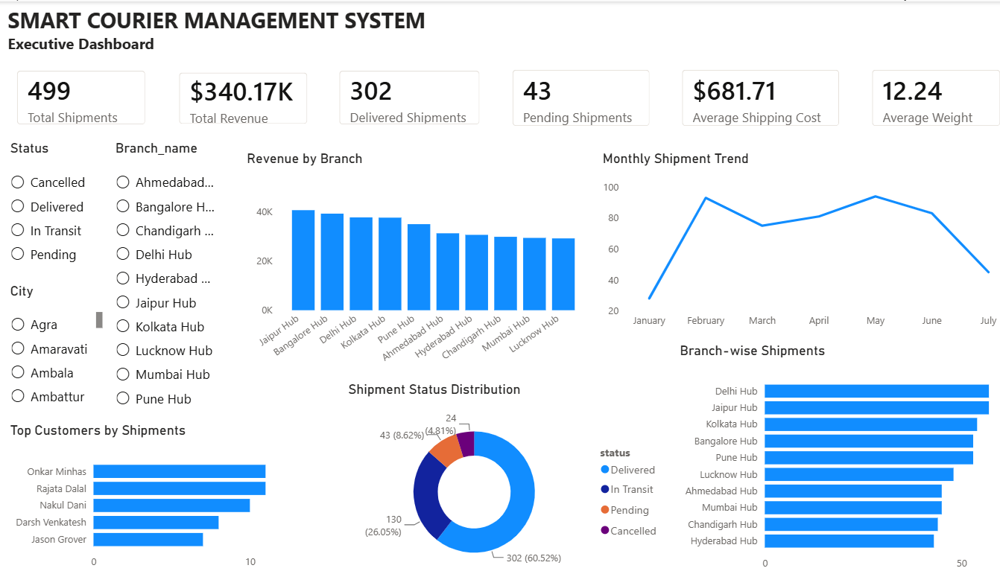

# 🚚 Smart Courier Management System

A complete end-to-end **Courier Management System** built using **Python, MySQL, SQL, and Power BI**. The project manages courier operations through CRUD functionality, stores data in a relational MySQL database, generates business reports using SQL, and provides an interactive Power BI dashboard for shipment, revenue, branch, and customer analytics.

Realistic sample data is generated using the **Faker** library to simulate real-world logistics operations.

---

# 📌 Features

## 🚛 Shipment Management

- View all shipments
- Search shipment by Shipment ID
- Add a new shipment
- Update shipment status
- Delete shipment

---

## 📈 Business Reports

- Total Shipments
- Shipment Status Report
- Branch-wise Shipment Report
- Revenue Report
- Top 5 Customers
- Monthly Shipment Trend

---

## 📊 Power BI Executive Dashboard

- Total Shipments KPI
- Total Revenue KPI
- Delivered & Pending Shipments
- Average Shipping Cost
- Average Shipment Weight
- Revenue by Branch
- Monthly Shipment Trend
- Shipment Status Distribution
- Branch-wise Shipment Analysis
- Top Customers by Shipments
- Interactive Filters (Status, Branch, City)

---

## 🎲 Data Generation

- Generate realistic customer records using Faker
- Generate branch records
- Generate shipment records with realistic booking dates and delivery statuses

---

# 🛠 Tech Stack

- Python
- MySQL
- SQL
- Power BI
- DAX
- Faker
- mysql-connector-python
- Tabulate

---

# 📂 Project Structure

```
Smart-Courier-Management-System
│
├── SQL/
│   └── courier_database.sql
│
├── config.py
├── database.py
├── generate_branches.py
├── generate_customers.py
├── generate_shipments.py
├── shipment.py
├── reports.py
├── main.py
├── requirements.txt
├── README.md
└── PowerBI/
    └── Courier_Dashboard.pbix
```

---

# 🗄 Database Schema

The project consists of three relational tables.

## Customers

- customer_id
- customer_name
- phone
- email
- city

---

## Branches

- branch_id
- branch_name
- city
- manager_name

---

## Shipments

- shipment_id
- customer_id
- branch_id
- origin
- destination
- weight
- booking_date
- expected_delivery
- actual_delivery
- status
- shipping_cost

---

# 📊 SQL Concepts Used

- SELECT
- INSERT
- UPDATE
- DELETE
- INNER JOIN
- GROUP BY
- ORDER BY
- COUNT()
- SUM()
- AVG()
- MAX()
- MIN()
- LIMIT
- DATE_FORMAT()

---

# 📈 Power BI Dashboard

The project includes an interactive executive dashboard connected to the MySQL database.

### Dashboard Highlights

- Executive KPI Cards
- Monthly Shipment Trend
- Revenue by Branch
- Shipment Status Distribution
- Branch-wise Shipment Analysis
- Top Customers by Shipments
- Interactive Slicers (Status, Branch, City)

---

# 🖼 Dashboard Preview



# 🔄 Project Workflow

```
Faker
   │
   ▼
MySQL Database
   │
   ▼
Python CRUD Application
   │
   ▼
SQL Reports
   │
   ▼
Power BI Dashboard
```

---

# ⚙ Installation

## 1. Clone the repository

```bash
git clone https://github.com/your-username/Smart-Courier-Management-System.git
```

---

## 2. Navigate to the project folder

```bash
cd Smart-Courier-Management-System
```

---

## 3. Install dependencies

```bash
pip install -r requirements.txt
```

---

## 4. Create the database

Run

```
SQL/courier_database.sql
```

using MySQL Workbench.

---

## 5. Configure Database Credentials

Open **config.py** and update:

- Host
- Username
- Password
- Database Name

---

## 6. Generate Sample Data

```bash
python generate_customers.py
python generate_branches.py
python generate_shipments.py
```

---

## 7. Run the Application

```bash
python main.py
```

---

# 📊 Business Insights Generated

The dashboard provides insights such as:

- Total Shipments Processed
- Revenue Generated
- Delivery Success Rate
- Pending & Cancelled Shipments
- Branch Performance
- Monthly Shipment Trends
- Top Customers
- Average Shipping Cost
- Average Shipment Weight

---

# 💡 Skills Demonstrated

- Python Programming
- MySQL
- SQL
- Power BI
- DAX
- Data Analysis
- Data Visualization
- Relational Database Design
- CRUD Operations
- Business Reporting
- Dashboard Development
- Data Modeling

---

# 🎯 Learning Outcomes

Through this project I gained practical experience in:

- Designing relational databases
- Integrating Python with MySQL
- Building CRUD applications
- Writing SQL queries for business reporting
- Creating interactive Power BI dashboards
- Developing KPI cards using DAX
- Data visualization and storytelling
- Generating realistic datasets using Faker
- Modular Python application development

---

# 🚀 Future Enhancements

- User Authentication
- Shipment Tracking using Tracking ID
- Email/SMS Notifications
- Export Reports to Excel/PDF
- Predictive Delivery Time using Machine Learning
- Flask-based Web Application

---

# 👨‍💻 Author

**Prashant Bhati**

Final Year B.E. Computer Science Student

UIET, Panjab University, Chandigarh

---
